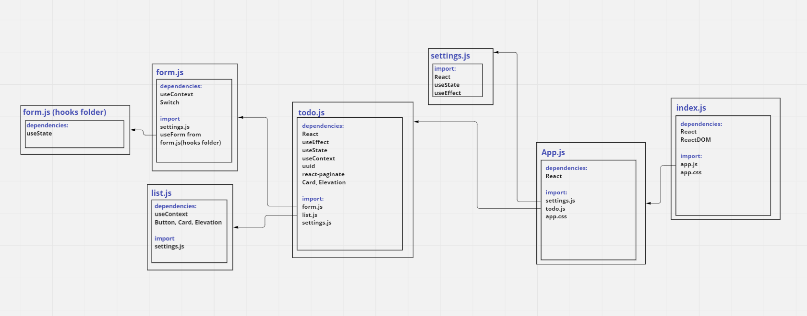

# Todo-app

## Documentation

### useForm hook
useForm is a custom hook for managing forms with ease. It takes one object as optional argument. 

## UML Diagram

## Links

### [Pull Request](https://github.com/hadeel999/todo-app/pull/2)

### [Netlify](https://63052b4aae051a04ff717de6--dainty-starburst-e5e17d.netlify.app/)